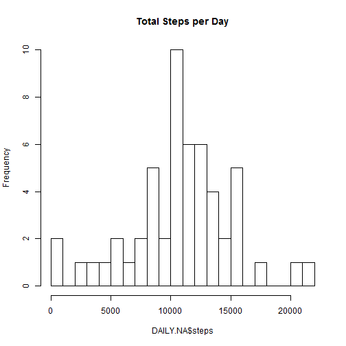
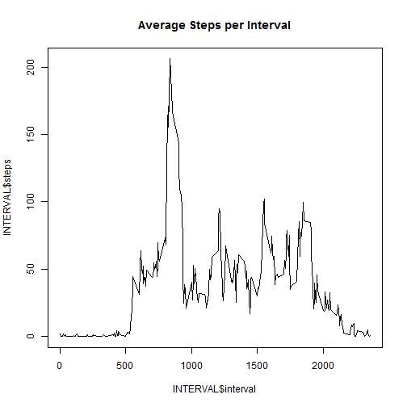
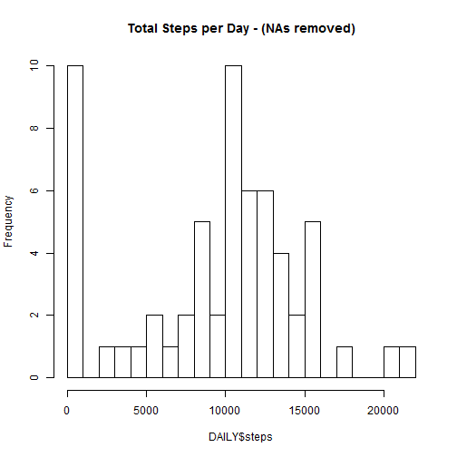
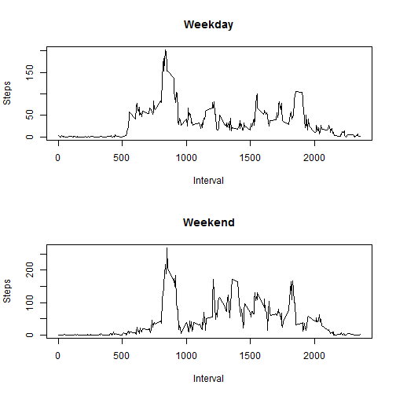

In this markdown document we will walk through the process by which we import, manipulate, analyze and report our findings on the dataset, "activity.csv."

First, load the packages that will be used to complete the task.

##  Utilities

```r
library(dplyr)
```

```
## 
## Attaching package: 'dplyr'
## 
## The following object is masked from 'package:stats':
## 
##     filter
## 
## The following objects are masked from 'package:base':
## 
##     intersect, setdiff, setequal, union
```

```r
library(lubridate)
library(ggplot2)
```

```
## Warning: package 'ggplot2' was built under R version 3.1.3
```

##  Data Import 


```r
#  Import "activity.csv" to df.raw
df.raw <- read.csv("activity.csv", header = TRUE, stringsAsFactors = FALSE)
str(df.raw)
```

```
## 'data.frame':	17568 obs. of  3 variables:
##  $ steps   : int  NA NA NA NA NA NA NA NA NA NA ...
##  $ date    : chr  "2012-10-01" "2012-10-01" "2012-10-01" "2012-10-01" ...
##  $ interval: int  0 5 10 15 20 25 30 35 40 45 ...
```


##  Processing Data

Loop through DATA.NA and take the sum() of the total steps for each day. 
Since this process will be completed again later to group DATA by day as well we should create a function to do this for us. 

This function groupBYday() takes two parameters and returns a dataframe. 
The first parameter, data, defaults to our dataset, df.raw. 
The second parameter, remove_NA, is set to FALSE. 
When set to TRUE, the function will first remove the NA values from df.raw, then group by day. 


```r
groupBYday <- function(data = df.data, remove_NA = FALSE) {
  #  Initialize catch variable
  daily.steps <- c()
  
  ##  Get Unique Days from DATA$date
  days <- unique(data$date)

  ##  For loop through days
  for (i in 1:length(days)) {
      ##  Create Total Steps for day
      daily.steps[i] <- sum(data[data$date == days[i],1], na.rm = remove_NA)
  }
  # Create Data Frame
  df <- data.frame(days = days, steps = daily.steps)
  
  return(df)
}
```

Using the function groupBYday() Sum the numbers of Daily Steps, with and without NA...

```r
  #DAILY.NA will include NA values.
  DAILY.NA <- groupBYday(df.raw)
  #DAILY will exclude NA values.
  DAILY <- groupBYday(df.raw, remove_NA = TRUE)
```

We can now use the DAILY.NA to make a histogram of Total Steps per Day...

```r
hist(DAILY.NA$steps, breaks = 25, main= "Total Steps per Day")
```

 

Using this data we can also answer our questions about the sample statistics...

```
## [1] "The Mean Number of steps taken each day is...9354.22950819672 steps."
```

```
## [1] "The Median Number of steps taken each day is...10395 steps."
```

Like the above problem we need to now group the data but this time by interval...

```r
#  GROUP BY INTERVAL
groupBYint <- function (data) {
    ##  Get Unique Intervals from df.int$interval
    int <- unique(data$interval)
    int.steps <- c()
    
    ##  For loop through days; Sum total Steps
    for (i in 1:length(int)) {
      ##  Create Average Steps for Intervals
      int.steps[i] <- mean(data[data$interval == int[i],1], na.rm = TRUE)
      }
      ##  Fill Data Frame
      df <- data.frame(interval = int, steps = int.steps)
      return(df)
}
    
##  Call groupByint to Average Steps per Interval
    INTERVAL <<- groupBYint(df.raw)
    str(INTERVAL)
```

```
## 'data.frame':	288 obs. of  2 variables:
##  $ interval: int  0 5 10 15 20 25 30 35 40 45 ...
##  $ steps   : num  1.717 0.3396 0.1321 0.1509 0.0755 ...
```

Now we can use this Data to plot a Time Series of these Interval Averages

```r
plot(x=INTERVAL$interval,INTERVAL$steps, type = "l", main = "Average Steps per Interval")
```

 

We can also now answer another question...

```r
highstep <- max(INTERVAL$steps)
max.int <- INTERVAL[INTERVAL$steps == highstep, ]
```

```
## [1] "The interval with the highest average steps across all days is interval 835"
```

```
## [1] "On average this interval has a step count of 206.169811320755 steps."
```

Now lets take a look at a histogram of the grouped by Day Data without the NA values.
Remember we created a function called groupBYday() and used it to create DAILY
Lets look at DAILY as the dataset and a historgram to observe our daily step total without the NA values. 

```r
str(DAILY)
```

```
## 'data.frame':	61 obs. of  2 variables:
##  $ days : Factor w/ 61 levels "2012-10-01","2012-10-02",..: 1 2 3 4 5 6 7 8 9 10 ...
##  $ steps: int  0 126 11352 12116 13294 15420 11015 0 12811 9900 ...
```

```r
hist(DAILY$steps, breaks = 25, main= "Total Steps per Day - (NAs removed)")
```

 

Looking at the difference here we can see that our subject may be much lazier that we orginally assumed!
Look at the spike in frequency of days with 0 activity!


Lastly, lets see us we can detect any differences in activity patterns between weekdays and weekends?!

```r
WEEK <- df.raw
##  Make Dates 
WEEK$date <- ymd(WEEK$date)

##  Add new column weekday to df.wday
WEEK <- mutate(WEEK, weekday = wday(WEEK$date))

WEEKDAY <- WEEK[WEEK$weekday < 6,]
WEEKEND <- WEEK[WEEK$weekday > 5,]
    
#  Use groupBYint to calculate interval average for weekdays and weekends
WDAY.INT <- groupBYint(WEEKDAY)
WEND.INT <- groupBYint(WEEKEND)
```

Using these data frames we can now take a look at a panel plot of these averages comparing the average steps taken per interval for weekdays vs. weekends...

```r
par(mfrow=c(2,1))
plot(WDAY.INT$interval, WDAY.INT$steps, type = "l", main = "Weekday", xlab = "Interval", ylab = "Steps")
plot(WEND.INT$interval, WEND.INT$steps, type = "l", main = "Weekend", xlab = "Interval", ylab = "Steps")
```

 

knit
